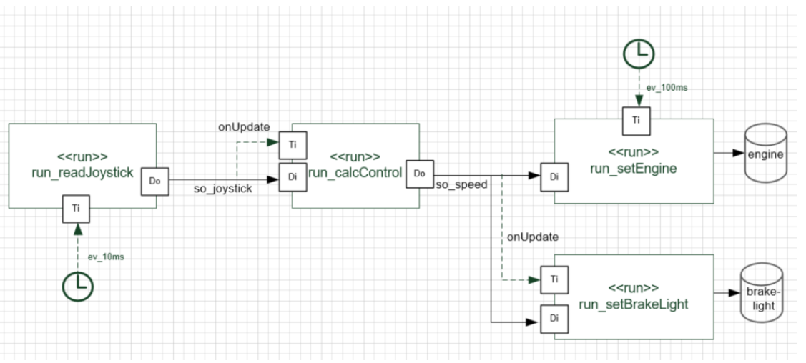

# A light version of the Autosar RTE - **Electronic Gaspedal** #

An ECU that follows the Autosar RTE concept is to be developed. In the concept, th applications software and the basic software (drivers and OS) are separated by an intermediate layer called RTE, which provides data containers for a message based communication between runnables and manages events (cyclic and data), which will activate the various runnables. 

The runnables represent the user code. They only communicate via RTE signal objects, direct hardware driver and OS calls are not allowed. This separation favcilitates re-use over projects and controller boundaries. 

The picture below illustrates the basic functionality of the system. The focus of this exercise is the RTE.

The runnable *run_readJoystick* will be called every 10ms. This runnable will update the *joystick* signal, using the API *pullPort()*. As this signal is realized as asyn-chronous signal (details see below), an event will be fired upon update.
This event will trigger the runnable *run_calcControl*. This runnable will check the value of the joystick signal (datatype *sint8_t*). If the value is bigger than 0, the *speed* signal (uint8_t) will be set to 2 x the joystick value. If it is below or equal to 0, the *engine* value will be 0.

Once this value is updated, the *run_setBrakeLight* will be triggered.

*run_setEngine* will be called every 100ms and copy the *speed* signal to the *engine* signal (if it is not too old) and call the driver (*pushPort*). In case of a too old speed signal, the value 0 shall be written to the engine.

*run_setBrakeLight* will also check the *speed* value when it is updated. In case the *speed* value is 0, the signal *brakeLight* will be turned on, in case of a value bigger than 0 it will be turned off. The *brakeLight* signal then is also send to the hardware.

## Iteration 1: Configuration of RTE ##
RTE generator tool is used for the configuration of RTE

## Iteration 2: Add RTE to the project ##

Create a new Erika project and add a new folder \rte to your source folder. Copy the generated files to this folder.

Create an Erika project having the following resources:
-   tsk_Init()
-   tsk_Background()
-   Application tasks as required
    
        -   you can either create a single cyclic and event task for all runnables. In this case you omit the risk for races, but long running / low priority runnables cannot be interrupted. In this case, you need to create a manual tick evenbt for the tasks – check the details in the RTE Gen-erator help
        -   or you create a separate cyclic and event driven task (simple, but not really good from the functional structure)
        -   or you create an io and a control task (better functional structure)
        -   and for the age, you will need an additional system task for the age incrementation
-   Add Events as defined in the model
-   Add Alarms as defined in the model
        -   In case you have more than one cyclic trigger, you can also create a single alarm which is firing a callback. Inside the callback you manual-ly activate the tasks / fire the events as needed.
        -   This will allow you to use less (expensive) OS resources.

## Iteration 3: Getting it running ##

In the code for the *joystick* driver, read the *joystick ADC value* (implement a driver to read the values) I.e. the middle position represents the value 0, the right and upper point the value 127 and the lower and left point the value -128. 

The *pwm* driver should write the engine value to the RGB LED, using the green channel.

The *gpio* driver should write a ON signal to the red LED in case the *so_brakeLight* is on (TRUE), or an OFF signal in case the signal is off (FALSE).

Now let’s add the code to the runnables as described in the initial chapter of this exer-cise.

It is recommended to start with the joystick runnable and to use e.g. the *UART_LOG port* to create some verbosity.

## Iteration 4 - Error Handling ##

RTE offers a variety of error signaling options which can and should be used to detect different error conditions.
-   The driver commands pushPort and pullPort return a possible error code of the driver.

In addition to this driver error code, the signal itself contain explicit and implicit error codes
-   The signal status identifies any error condition identified in the RTE, e.g. an error code returned from a driver – this allows the application to verify that val-id data is being used.
-   The signal age, which measures the time since the last valid update. It is up to the application to decide which age still is acceptable. For a short period, it might e.g. ok to use old data, if you can expect, that the next update will work again.

Besides the data, you should also supervise the activation of runnables – please check the next exercise for this.

# Timing Supervision #

Your task is to implement a timeout supervision concept for the PSOC. In case the system comes to a halt, e.g. caused by an endless loop or shutdown of the OS, a reboot should be initiated. This concept is called alive monitoring. As this is a pretty brute force error handling, an additional deadline monitoring shall be implemented, which supervises individual runnables.

## Hardware Watchdog Driver ##

![Requirement1] (./img/Requirement1.png)
![Requirement2] (./img/Requirement2.png)

## Alive watchdog ##

![Requirement3] (./img/Requirement3.png)

## Deadline monitoring ##

Alive monitoring typically serves as a last line of defense, as the system can only react with a rather harsh reaction like reset.

In order to control the timing a bit less harsh, deadline monitoring can be applied, by checking the runtime of a single runnable or group of runnables.

The concept would be as follows:
-   Before calling the runnables in a task, an alarm will be started.
-   During normal operation, all runnables will be finished before the alarm elaps-es and the alarm can be cancelled.
-   If one or more runnables take too long, the alarm will be fired and an error handling task will be activated, which e.g. can disable certain less critical run-nables.

Try to implement this concept and supervise the runtime of the cyclic and event trig-gered runnables of the exercise Electronic Gaspedal.